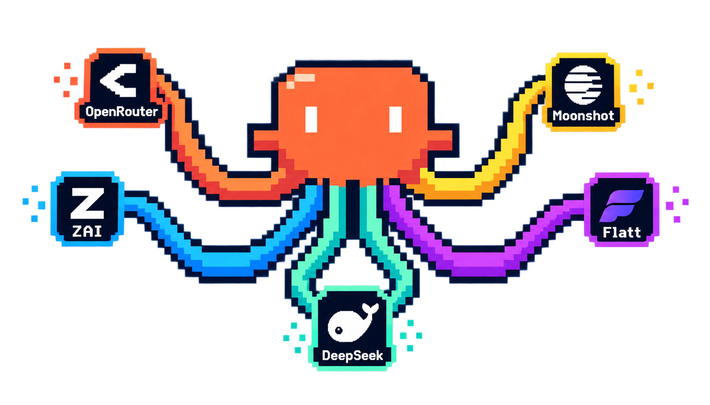
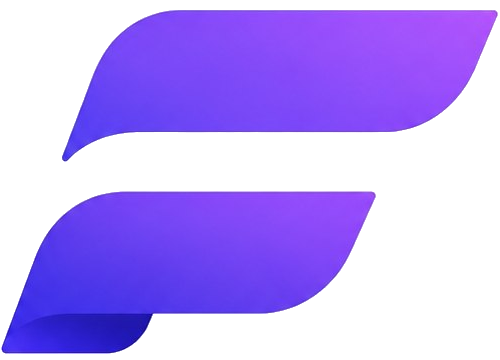

<h1 align="center">multi-claude</h1>

<p align="center">
  <a href="README.md">Português</a> · <b>English</b>
</p>

<div align="center">

[](https://github.com/leogomide/multi-claude/releases)
[](./LICENSE)
[](https://www.npmjs.com/package/@leogomide/multi-claude)
[](https://bun.sh)
[](https://docs.anthropic.com/en/docs/claude-code)

</div>

<div align="center">
  
</div>

<div align="center">

https://github.com/user-attachments/assets/d8565001-350a-46b8-ae28-6b5cc6937aa5

</div>

**Use [Claude Code](https://docs.anthropic.com/en/docs/claude-code) with any AI provider — and switch between them in seconds.**

Type `mclaude`, pick a provider and a model from a terminal menu, and Claude Code opens already configured. No environment variables to edit, no keys to copy around.

---

<div align="center">
  <sub>SPONSORED BY</sub>
  <br><br>
  <a href="https://flatt.com.br/?utm_source=github&utm_medium=sponsor&utm_campaign=multi-claude">
    
  </a>
  <h3>Flatt — inference at a flat rate.</h3>
  <p>
    Your agent runs all day, all month — the bill doesn't move.<br>
    No token counting, 262k context on every plan, and an Anthropic-compatible API<br>
    you can plug into <b>mclaude</b> as a <a href="#custom-provider">Custom provider</a> in one minute.
  </p>
  <a href="https://flatt.com.br/?utm_source=github&utm_medium=sponsor&utm_campaign=multi-claude">
    
  </a>
</div>

---

## Why multi-claude

- **20 providers in one menu** — DeepSeek, OpenRouter, Z.AI, MiniMax, Kimi, Ollama, LM Studio and more, plus any Anthropic-compatible gateway.
- **Multiple Anthropic accounts** — switch between personal and work accounts without logging out.
- **Isolated installations** — separate settings, MCP servers and history per context (work, personal, client).
- **Protected keys** — your API keys are encrypted on disk, with an optional master password.
- **Rich status line** — model, tokens, cost and context usage in real time inside Claude Code.
- **Interface in English**, Portuguese or Spanish.

## Installation

Requirements: [Bun](https://bun.sh) and [Claude Code](https://docs.anthropic.com/en/docs/claude-code).

```bash
bun install -g @leogomide/multi-claude
```

Or run it without installing:

```bash
bunx @leogomide/multi-claude
```

To update, run `bun install -g @leogomide/multi-claude@latest`. To uninstall, `bun remove -g @leogomide/multi-claude`.

## Usage

```bash
mclaude
```

1. Pick a provider from the main menu (or add one under **Manage providers**)
2. Pick a model
3. Pick an installation (or use the default)
4. Claude Code opens fully configured

Any extra argument is forwarded to Claude Code — for example, `mclaude -p "explain this codebase"`.

## Supported providers

| Provider | Type | Get access |
|----------|------|------------|
| Anthropic | Claude account (OAuth) | [claude.ai](https://claude.ai) |
| Alibaba Cloud | Subscription plan | [Model Studio](https://bailian.console.alibabacloud.com/) |
| BytePlus ModelArk | Subscription plan | [BytePlus](https://www.byteplus.com/en/activity/codingplan) |
| DeepSeek | API | [platform.deepseek.com](https://platform.deepseek.com) |
| Kimi Code | Subscription plan | [kimi.com](https://www.kimi.com/code/docs/en/more/third-party-agents.html) |
| MiniMax | Subscription plan | [platform.minimax.io](https://platform.minimax.io) |
| Moonshot AI | API | [platform.moonshot.ai](https://platform.moonshot.ai) |
| NanoGPT | Aggregator | [nano-gpt.com](https://nano-gpt.com/api) |
| Novita AI | API | [novita.ai](https://novita.ai) |
| OpenRouter | Aggregator | [openrouter.ai](https://openrouter.ai/keys) |
| Poe | Aggregator | [poe.com](https://poe.com) |
| Requesty | Aggregator | [requesty.ai](https://requesty.ai) |
| Z.AI Coding Plan | Subscription plan | [z.ai](https://z.ai/subscribe) |
| LiteLLM Proxy | Self-hosted proxy | [docs.litellm.ai](https://docs.litellm.ai/docs/) |
| llama.cpp | Local | [GitHub](https://github.com/ggml-org/llama.cpp) |
| LM Studio | Local | [lmstudio.ai](https://lmstudio.ai) |
| Ollama | Local | [ollama.com](https://ollama.com) |
| OmniRoute | Local | [GitHub](https://github.com/diegosouzapw/OmniRoute) |
| 9Router | Local | [GitHub](https://github.com/decolua/9router) |
| Custom provider | Any Anthropic-compatible API | — |

Local providers need no API key. OpenRouter, NanoGPT, LiteLLM and the local providers load their model list automatically.

### Custom provider

Using a gateway that is not on the list? Pick **Custom provider**: enter a name, the base URL and the token, and you are done. The model list is fetched from the endpoint itself. It works with corporate proxies, self-hosted gateways and services like [Flatt](https://flatt.com.br/?utm_source=github&utm_medium=sponsor&utm_campaign=multi-claude) — just paste the base URL and the key from your dashboard.

## Multiple Anthropic accounts

Add as many Anthropic (OAuth) accounts as you like — "Work", "Personal" — and log in once to each. Every account uses its own installation, with fully separate settings, history and MCP servers.

## Isolated installations

Claude Code uses `~/.claude/` by default. Under **Manage installations** you create independent configuration directories and choose which one to use for each session.

## Status line

mclaude adds a status line to Claude Code with real-time session information. Pick a template under **Settings → Status line**:

```
Provider/Opus (master +45 -7)
Input:84.2k    | Output:62.8k   | Cache:20.6M
Session:3h31m  | API:1h38m      | Cost:$11.15    | $0.19/min
━━━━━━━━━━━━━━━━━━━━━━━━╌╌╌╌╌╌╌ | 153.9k/77%     | 46.1k/23% left (imminent)
```

The `full`, `slim`, `mini`, `cost`, `perf` and `context` templates are also available.

## Automation (headless mode)

Skip the menu by passing the provider on the command line — handy for scripts and AI agents:

```bash
mclaude --provider deepseek --model deepseek-chat -p "explain this function"
mclaude --list   # prints providers, models and installations as JSON
```

The [`mclaude-headless`](.claude/skills/mclaude-headless/) skill teaches agents to use mclaude this way. See every option with `mclaude --help`.

## Security

API keys are encrypted with **AES-256-GCM** before they touch the disk. For an extra layer, turn on a master password under **Settings → Set master password**.

## Sponsors

<a href="https://flatt.com.br/?utm_source=github&utm_medium=sponsor&utm_campaign=multi-claude">
  
</a>

**[Flatt](https://flatt.com.br/?utm_source=github&utm_medium=sponsor&utm_campaign=multi-claude)** — LLM inference at a flat monthly price, built for coding agents that run all day. Works with mclaude as a [Custom provider](#custom-provider).

<br clear="left"/>

## What's new

See the [CHANGELOG](CHANGELOG.md) or the [releases](https://github.com/leogomide/multi-claude/releases). The history is also available inside the app, on the **Changelog** screen.

## Development

```bash
bun install && bun link
mclaude                  # run the CLI
bunx tsc --noEmit        # type check
bun test                 # smoke tests
```

## License

[MIT](./LICENSE)
