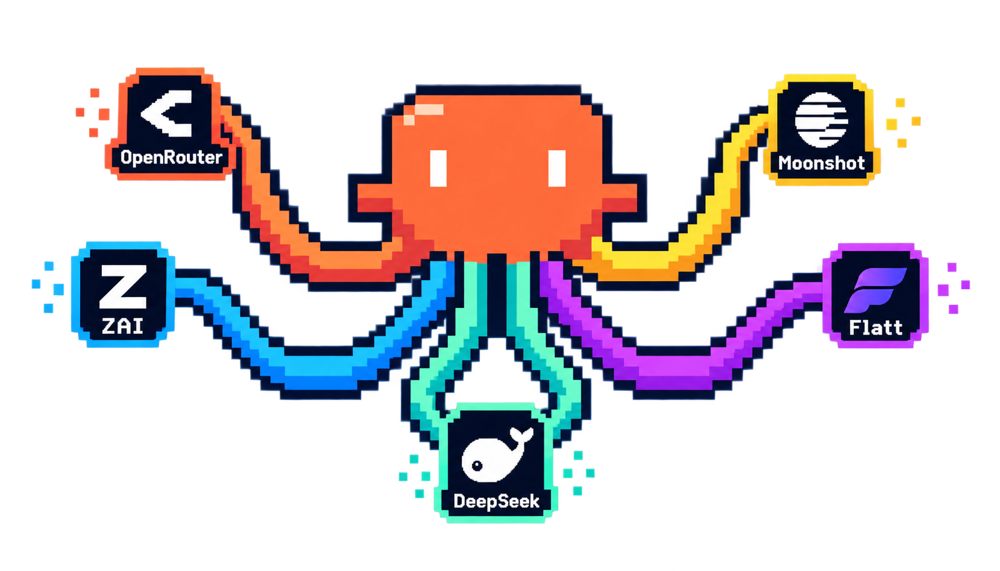
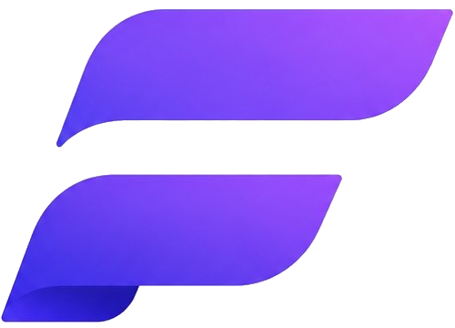

<h1 align="center">multi-claude</h1>

<p align="center">
  <a href="README.md">Português</a> · <a href="README.en.md">English</a> · <b>Español</b>
</p>

<div align="center">

[](https://github.com/leogomide/multi-claude/releases)
[](./LICENSE)
[](https://www.npmjs.com/package/@leogomide/multi-claude)
[](https://nodejs.org)
[](https://docs.anthropic.com/en/docs/claude-code)

</div>

<div align="center">
  
</div>

<div align="center">

https://github.com/user-attachments/assets/d8565001-350a-46b8-ae28-6b5cc6937aa5

</div>

**Usa [Claude Code](https://docs.anthropic.com/en/docs/claude-code) con cualquier proveedor de IA — y cambia entre ellos en segundos.**

Escribe `mclaude`, elige el proveedor y el modelo en un menú de terminal, y Claude Code se abre ya configurado. Sin editar variables de entorno, sin copiar claves de un lado a otro.

---

<div align="center">
  <sub>PATROCINADO POR</sub>
  <br><br>
  <a href="https://flatt.com.br/?utm_source=github&utm_medium=sponsor&utm_campaign=multi-claude">
    
  </a>
  <h3>Flatt — inferencia a precio fijo.</h3>
  <p>
    Tu agente funciona todo el día, todo el mes — y la factura no cambia.<br>
    API compatible con Anthropic e integrada en <b>mclaude</b> como proveedor nativo:<br>
    es el primero de la lista, solo pega tu clave.
  </p>
  <a href="https://flatt.com.br/?utm_source=github&utm_medium=sponsor&utm_campaign=multi-claude">
    
  </a>
</div>

---

## Por qué usar

- **21 proveedores en un solo menú** — DeepSeek, OpenRouter, Z.AI, MiniMax, Kimi, Ollama, LM Studio y muchos más, además de cualquier gateway compatible con la API de Anthropic.
- **Varias cuentas de Anthropic** — alterna entre tu cuenta personal y la del trabajo sin cerrar sesión.
- **Instalaciones aisladas** — configuración, MCP e historial separados por contexto (trabajo, personal, cliente).
- **Claves protegidas** — tus API keys permanecen cifradas en el disco, con contraseña maestra opcional.
- **Status line completa** — modelo, tokens, costo y uso de contexto en tiempo real dentro de Claude Code.
- **Interfaz en español**, portugués o inglés.

## Instalación

Requisitos: [Node.js](https://nodejs.org) 22 o superior y [Claude Code](https://docs.anthropic.com/en/docs/claude-code).

```bash
npm i -g @leogomide/multi-claude
```

También funciona con `pnpm add -g @leogomide/multi-claude` o `bun add -g @leogomide/multi-claude`. Para ejecutarlo sin instalar: `npx @leogomide/multi-claude`.

Para actualizar, usa la opción de update dentro de la app o reinstala con el mismo gestor. Para desinstalar: `npm rm -g @leogomide/multi-claude`.

- **¿Solo tienes Bun?** Ejecútalo con `bunx @leogomide/multi-claude`. Un `mclaude` instalado globalmente requiere Node.js en el PATH.
- **¿Detrás de un proxy corporativo?** Define `NODE_USE_ENV_PROXY=1` (Node 22.21+) junto con `HTTPS_PROXY`, y `NODE_EXTRA_CA_CERTS` si tu red usa su propia CA.

## Cómo usar

```bash
mclaude
```

1. Elige un proveedor en el menú principal (o añade uno en **Gestionar proveedores**)
2. Elige el modelo
3. Elige la instalación (o usa la predeterminada)
4. Claude Code se abre con todo configurado

Cualquier argumento adicional se pasa a Claude Code — por ejemplo, `mclaude -p "explica este proyecto"`.

## Proveedores compatibles

| Proveedor | Tipo | Dónde obtener acceso |
|-----------|------|----------------------|
| ★ Flatt | Plan de suscripción (precio fijo) | [flatt.com.br](https://flatt.com.br/?utm_source=github&utm_medium=sponsor&utm_campaign=multi-claude) |
| Anthropic | Cuenta de Claude (OAuth) | [claude.ai](https://claude.ai) |
| Anthropic (setup-token) | Cuenta de Claude (token de larga duración) | `claude setup-token` |
| Alibaba Cloud | Plan de suscripción | [Model Studio](https://bailian.console.alibabacloud.com/) |
| BytePlus ModelArk | Plan de suscripción | [BytePlus](https://www.byteplus.com/en/activity/codingplan) |
| DeepSeek | API | [platform.deepseek.com](https://platform.deepseek.com) |
| Kimi Code | Plan de suscripción | [kimi.com](https://www.kimi.com/code/docs/en/more/third-party-agents.html) |
| MiniMax | Plan de suscripción | [platform.minimax.io](https://platform.minimax.io) |
| Moonshot AI | API | [platform.moonshot.ai](https://platform.moonshot.ai) |
| NanoGPT | Agregador | [nano-gpt.com](https://nano-gpt.com/api) |
| Novita AI | API | [novita.ai](https://novita.ai) |
| OpenRouter | Agregador | [openrouter.ai](https://openrouter.ai/keys) |
| Poe | Agregador | [poe.com](https://poe.com) |
| Requesty | Agregador | [requesty.ai](https://requesty.ai) |
| Z.AI Coding Plan | Plan de suscripción | [z.ai](https://z.ai/subscribe) |
| LiteLLM Proxy | Proxy propio | [docs.litellm.ai](https://docs.litellm.ai/docs/) |
| llama.cpp | Local | [GitHub](https://github.com/ggml-org/llama.cpp) |
| LM Studio | Local | [lmstudio.ai](https://lmstudio.ai) |
| Ollama | Local | [ollama.com](https://ollama.com) |
| OmniRoute | Local | [GitHub](https://github.com/diegosouzapw/OmniRoute) |
| 9Router | Local | [GitHub](https://github.com/decolua/9router) |
| Proveedor personalizado | Cualquier API compatible con Anthropic | — |

Los proveedores locales no necesitan API key. En Flatt, OpenRouter, NanoGPT, LiteLLM y los locales, la lista de modelos se carga automáticamente.

### Proveedor personalizado

¿Tienes un gateway que no está en la lista? Usa el **Proveedor personalizado**: indica un nombre, la URL base y el token, y listo. La lista de modelos se consulta en el propio endpoint. Funciona con proxies corporativos, gateways propios y cualquier servicio compatible con la API de Anthropic.

## Varias cuentas de Anthropic

Añade tantas cuentas de Anthropic (OAuth) como quieras — "Trabajo", "Personal" — e inicia sesión una vez en cada una. Cada cuenta usa su propia instalación, con configuración, historial y MCP completamente separados.

¿Sin navegador a mano, o quieres el mismo login en varias máquinas? Ejecuta `claude setup-token` (requiere plan Pro, Max, Team o Enterprise), pega el token en el proveedor **Anthropic (setup-token)** y listo: mclaude lo envía como `CLAUDE_CODE_OAUTH_TOKEN`. El token dura 1 año, Claude Code elige el modelo por sí mismo (`/model`) y funciona también con la instalación predeterminada. El modo `--bare` ignora este token.

## Instalaciones aisladas

Por defecto, Claude Code usa `~/.claude/`. En **Gestionar instalaciones** creas directorios de configuración independientes y eliges cuál usar en cada sesión.

## Status line

mclaude añade a Claude Code una status line con información de la sesión en tiempo real. Elige la plantilla en **Configuración → Línea de estado**:

```
Provider/Opus (master +45 -7)
Input:84.2k    | Output:62.8k   | Cache:20.6M
Session:3h31m  | API:1h38m      | Cost:$11.15    | $0.19/min
━━━━━━━━━━━━━━━━━━━━━━━━╌╌╌╌╌╌╌ | 153.9k/77%     | 46.1k/23% left (imminent)
```

También están disponibles las plantillas `full`, `slim`, `mini`, `cost`, `perf` y `context`.

## Automatización (modo headless)

Omite el menú indicando el proveedor en la línea de comandos — útil para scripts y agentes de IA:

```bash
mclaude --provider deepseek --model deepseek-chat -p "explica esta función"
mclaude --list   # lista proveedores, modelos e instalaciones en JSON
```

La skill [`mclaude-headless`](.claude/skills/mclaude-headless/) enseña a los agentes a usar mclaude de esta forma. Consulta todas las opciones con `mclaude --help`.

## Seguridad

Las API keys se cifran con **AES-256-GCM** antes de ir al disco. Para una capa extra, activa una contraseña maestra en **Configuración → Establecer contraseña maestra**.

## Patrocinadores

<a href="https://flatt.com.br/?utm_source=github&utm_medium=sponsor&utm_campaign=multi-claude">
  
</a>

**[Flatt](https://flatt.com.br/?utm_source=github&utm_medium=sponsor&utm_campaign=multi-claude)** — inferencia a precio fijo mensual, hecha para agentes de código que funcionan todo el día. Proveedor nativo de mclaude, el primero de la lista.

<br clear="left"/>

## Novedades

Consulta el [CHANGELOG](CHANGELOG.md) o las [releases](https://github.com/leogomide/multi-claude/releases). El historial también aparece dentro de la app, en la pantalla **Changelog**.

## Desarrollo

```bash
pnpm install             # instala y compila (prepare)
pnpm link --global       # expone el `mclaude` local (ejecuta `pnpm setup` una vez antes)
pnpm build:watch         # recompilación continua; en otra terminal: mclaude
pnpm check-types         # verificación de tipos
pnpm test                # pruebas (Vitest)
pnpm lint                # biome
```

## Licencia

[MIT](./LICENSE)
